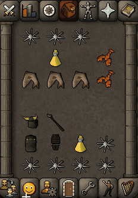

# Consumable Cooldowns Plugin

This Old School RuneScape script demonstrates cooldowns on food and drink items in your inventory. It is inspired by Copy Pasta's plugin on RuneLite.

## Features

- Displays cooldown overlays on consumable items.
- Handles food, drink, and combo food items.
- Updates cooldowns in real-time based on game ticks.
- Listens for game messages to detect when the player consumes items.
- Provides a user-friendly overlay for cooldown visualization.

## Setup

1. Open the project in your preferred Java IDE (e.g., IntelliJ IDEA).

2. Ensure that you have the DreamBot API installed and correctly set up in your project.

3. Compile and run the plugin within the DreamBot environment.

## Usage

1. Start the plugin from the DreamBot script manager.
2. The plugin will automatically begin tracking consumable items and display cooldowns as overlays on the items in your inventory.

## Screenshots

## GIF Demo

## Acknowledgments

- Inspired by Copy Pasta's RuneLite plugin.
